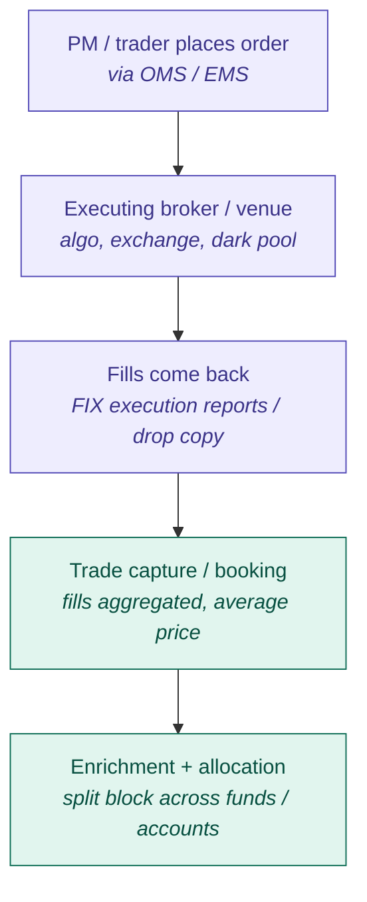
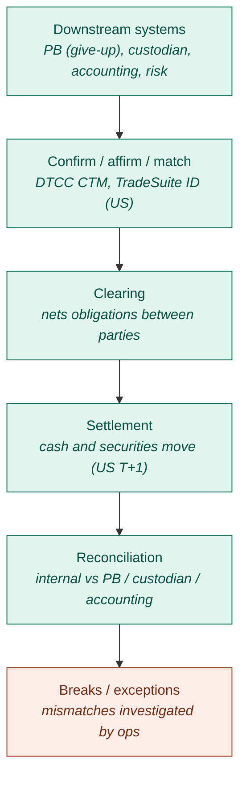
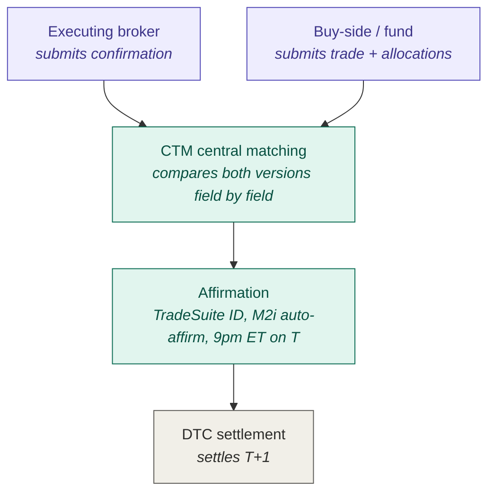

# Institutional trade lifecycle

## 1. Trade date — order to booking

Purple = front office · Green = middle office

## 2. Post-trade flow

## 3. DTCC CTM — confirmation and affirmation (US, T+1)

## Key points

- **Execution vs prime brokerage**: orders go to executing brokers/venues; trades executed away are *given up* to the PB, which handles custody, financing, margin, stock borrow, and settlement support.
- **Fill aggregation**: multiple fills may be booked as one average-price trade or kept as fill-level records, depending on booking logic.
- **T+1 (US, May 2024)**: allocation, confirmation, and affirmation must complete on trade date. DTC affirmation cutoff is 9:00 PM ET on T (SEC Rule 15c6-2 requires same-day affirmation agreements). For APAC funds this cutoff lands the next morning local time, making overnight automation critical.
- **Breaks**: reconciliation mismatches between internal records and PB/custodian/accounting records, investigated and resolved by ops/support.
